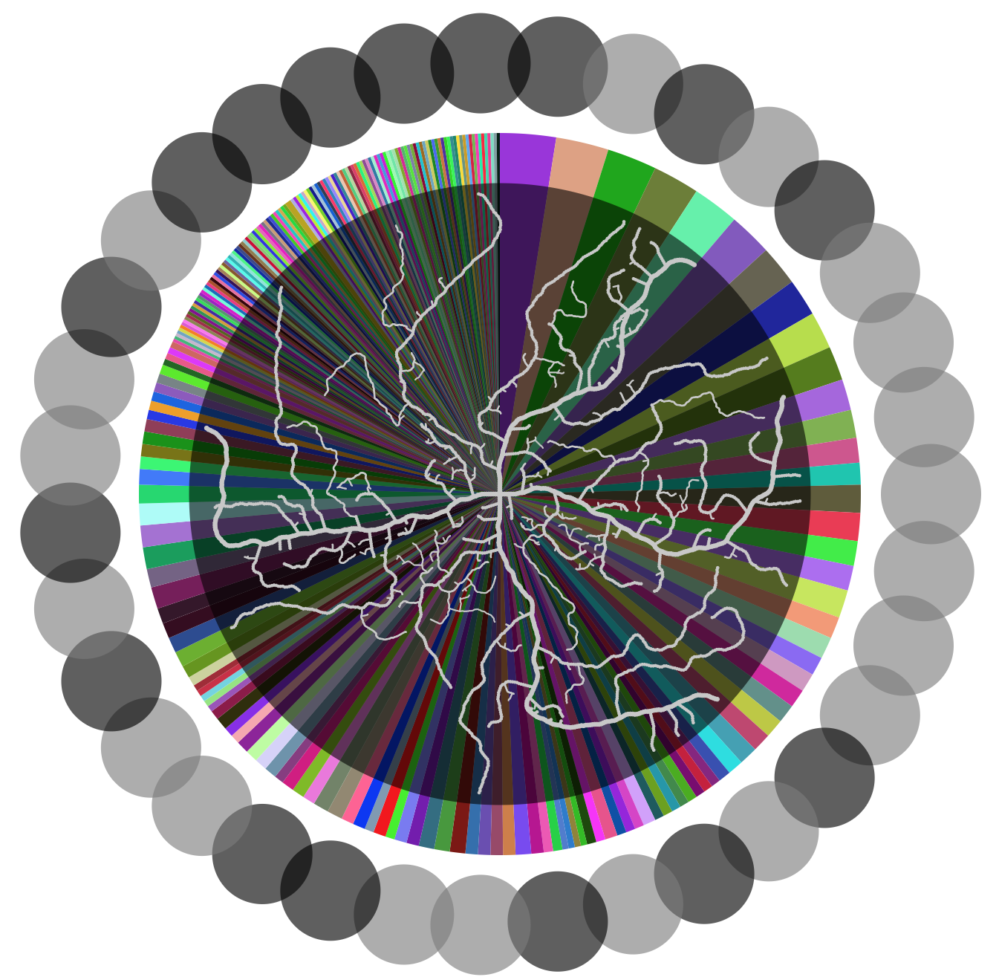
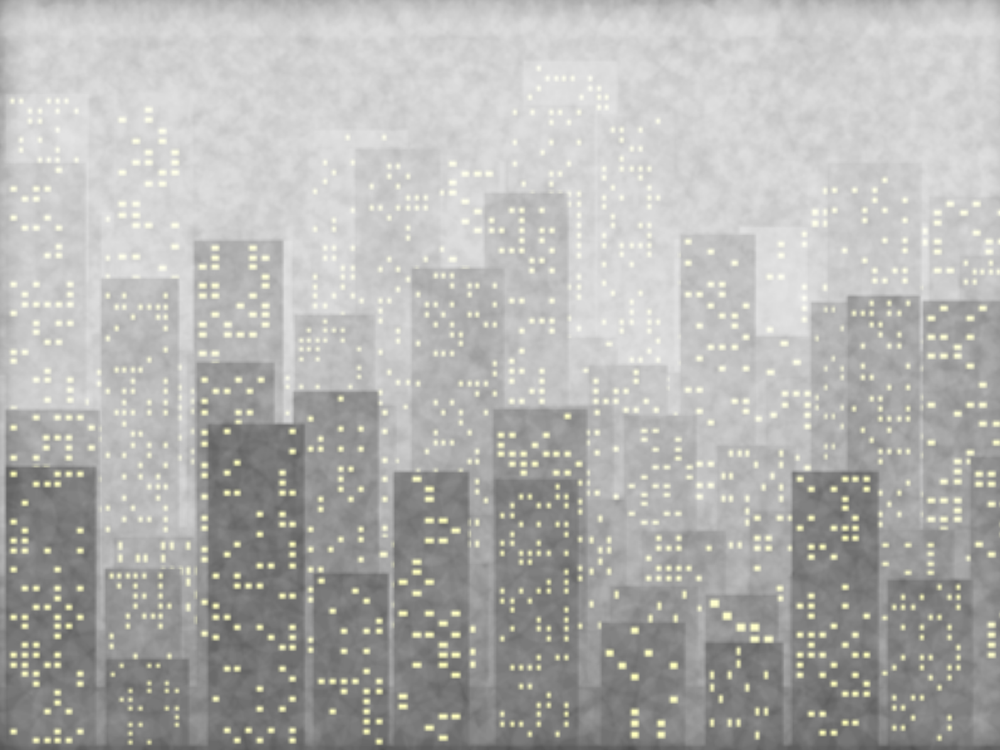
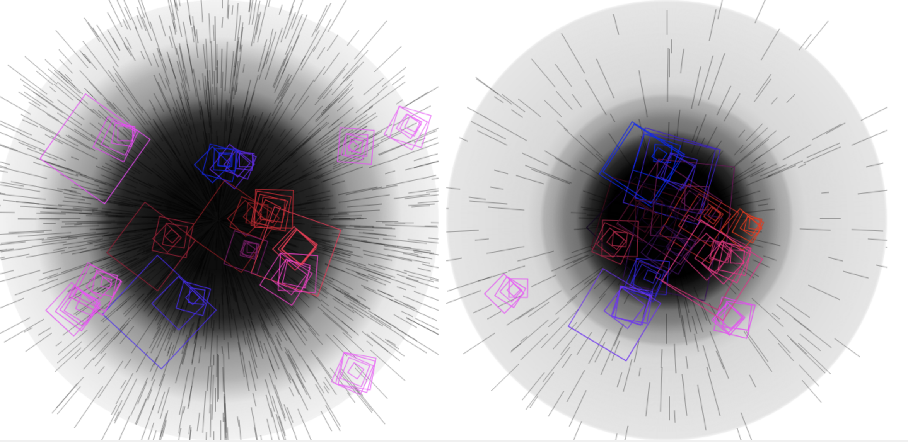

# Explaining Algorithms through Visuals

Experiments with implementing and applying algorithms to create interesting visuals, meant to hook the viewer in and encourage them to learn more about the underlying algorithm. Algorithms were written manually rather than using an external library. Algorithm inputs are randomized each time the code is run, creating a slightly different piece that still communicates the same underlying ideas. 

Select works are provided here, with further descriptions in the subfolders. The full set of pieces can be found and code can be run (here)[https://openprocessing.org/user/182815?o=3&view=sketches]. 

Algorithm to the piece's name correspondance is as follows:

- Simulated Annealing - Integration 

- Maximal Poisson-Disk Sampling - Fog, Digitized

- K-Means (and variations) - Void 

- Rabin-Karp String Search - Flight

Further description can be found in the subfolders.

# Featured Works

Also regarding visuals, I also made an (interactive Quarantine Simulator)[https://openprocessing.org/sketch/872413] to think about how various behaviors impact the spread of a disease, which was featured by the founder of OpenProcessing in the "Pandemics & Face Masks" and has 850 views.

The work "Integration" based on the simulated annealing algorithm was featured in the Mathematical Association of America Focus newsmagazine.

